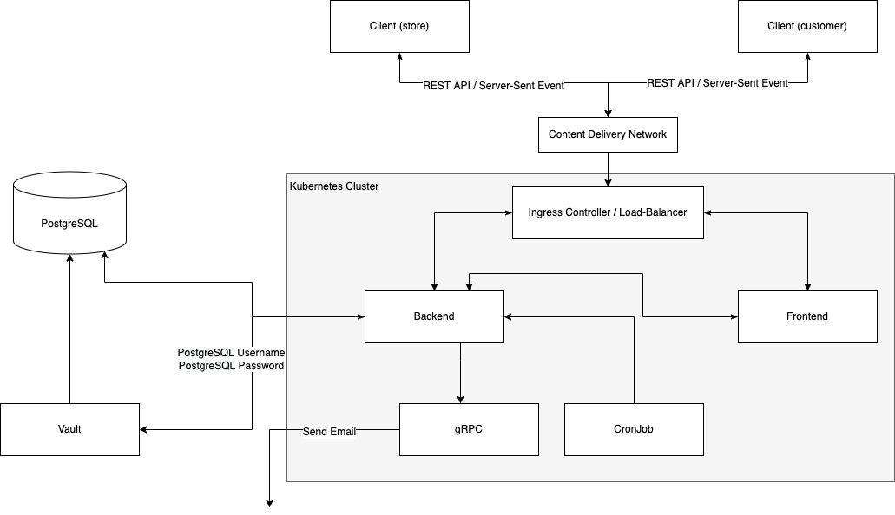

# Queue System

## Overview
Queue System 是一個商店排隊管理平台，提供商店管理目前正在排隊的顧客以及顧客目前的服務進度。

## Screenshots
商家在每次申請帳號後(開店)，可以使用此系統 24 小時，接著系統就會自動將帳號停止（關店）。隔天商家要開店並使用此系統，只要再重新申請帳號即可使用。

商家使用 email 和密碼進行登入，若商家忘記密碼，可以寄送重設密碼的 email。

重設密碼

商家可以主動點選關店，也可在開店後 24 小時，由系統自動關店(帳號停止)。帳號停止後，商家會收到一份 csv 報表，紀錄當日所有顧客的詳細資訊，方便商家做商業分析。

商家登入後會看到的主要管理頁面，QR Code 可以供顧客掃描以加入隊伍，而主要區塊可以看到目前隊伍內的所有顧客。

顧客掃描商家的 QR Code 後，商家的 QR Code 會立即更新。

顧客送出排隊資訊後，商家和顧客的排隊資訊區塊會立即更新。

商家可以變更顧客的服務狀態。

## Architecture

### Client (Store) and Client (Customer)
Client 會分成商家和顧客兩種使用角色。

### Deployment
Queue System 在 AWS EC2 內使用 MicroK8s 架設 k8s 群集，並使用 `Nginx Ingress Controller` 及 `MetalLB` (Load-Balancer) 讓群集內的服務與外部進行溝通。

k8s 群集內部屬了以下資源：
* Deployments:
  * Backend
  * Frontend
  * gRPC
* Services
  * Backend
  * Frontend
  * gRPC
* CronJob
  * 設定每分鐘執行程式以對 Backend Service 發送 REST API，檢查是否有開店已經 24 小時的商店，將其帳號停止，並寄送 csv 報表給商家，紀錄當日所有顧客的詳細資訊。
* Ingress
  * Nginx Ingress Controller
  * Ingress

### Backend
Queue System 的 Backend，使用 `Golang` 開發。它提供了 REST API 和 Server-Sent Event API。

### Frontend
Queue System 的 Frontend，使用 `ReactJS` 開發，並與 Backend 提供的 REST API 和 Server-Sent Event API 進行交互。

### gRPC
Backend 交給 gRPC Server 寄送 email，和產生店家的 csv 報表。

### PostgreSQL
Queue System 內所有資料儲存在 PostgreSQL 資料庫內，並且 PostgreSQL 資料庫沒有部屬於 k8s 群集之內。

### Vault
Backend 連接 Vault 以取得 PostgreSQL 的帳號和密碼，PostgreSQL 的帳號和密碼每小時會變更一次，並且 Vault 沒有部屬於 k8s 群集之內。

## TODO
* api doc
* sse
* env vars
* code structure
* log format
* token rule
* db user and vault rule